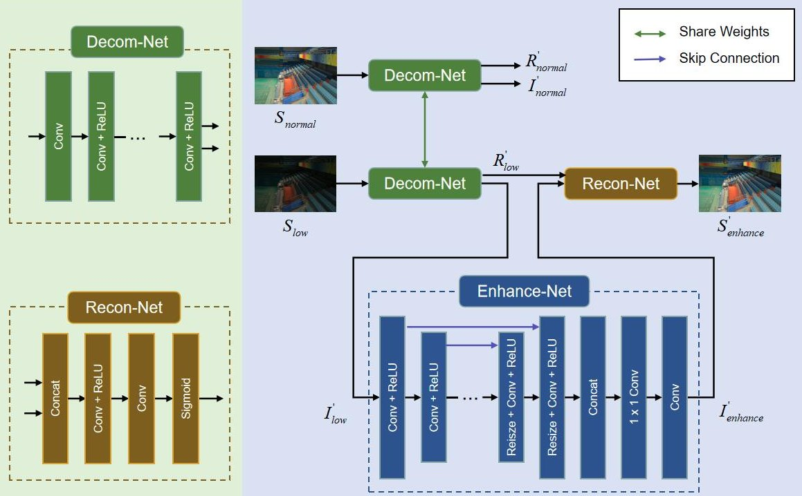
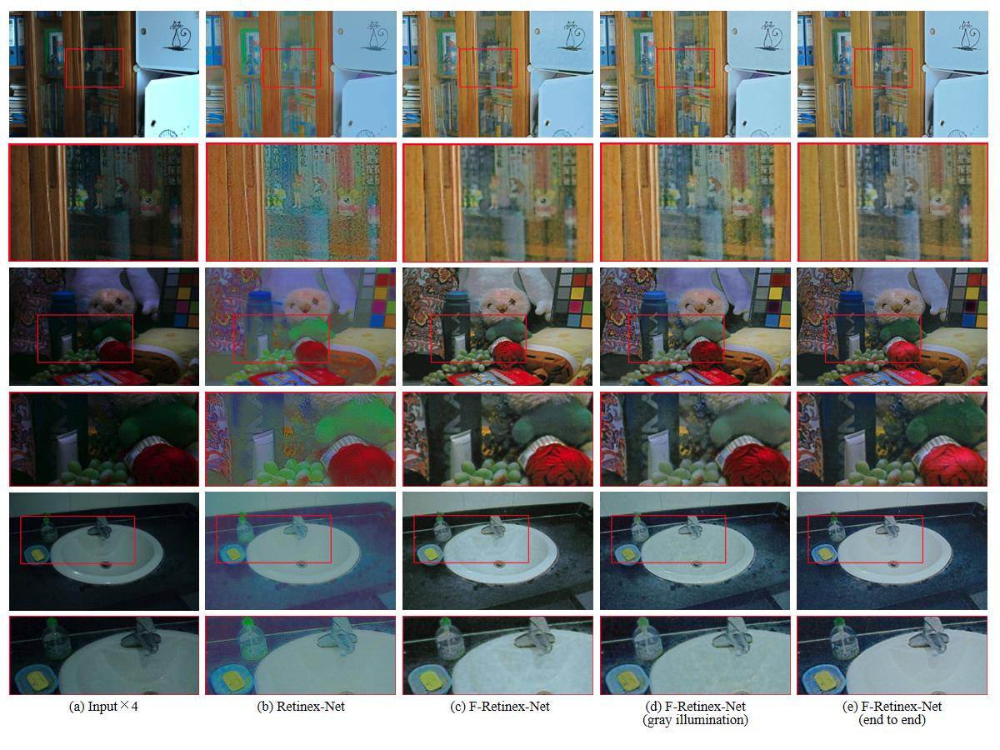
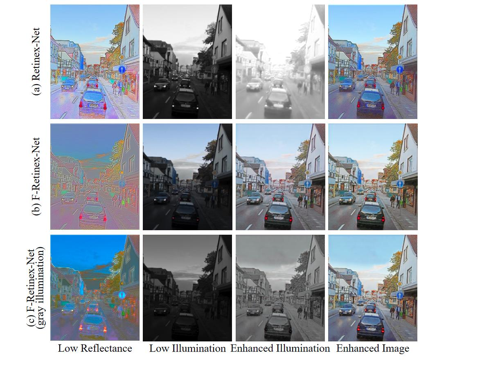

# F-Retinex-Net([paper](https://dl.acm.org/doi/10.1145/3441250.3441270))
Feature Based Deep Retinex for Low-Light Image Enhancement

This is a Tensorflow implement, fork from [Retinex-Net](https://github.com/weichen582/RetinexNet)

Network Structure:
<div align="center">
    
</div>

### Requirements ###
1. Python
2. Tensorflow >= 1.5.0
3. numpy, PIL

### Testing  Usage ###
you can just see some demo cases by
```shell
python main.py --phase=test --test_dir=./data/test/low
```
, the results will be saved under ```./test_results/```.

Some enhanced results:
<div align="center">
    
    
</div>

### Training Usage ###
First, download training data set from [Dataset](https://daooshee.github.io/BMVC2018website/). Save training pairs of our LOL dataset under `./data/our485/`, and synthetic pairs under `./data/syn/`.

Moving some data from `our485` to `eval15`:
```shell
cd data; python mv2eval.py
```
, all eval files: [./data/eval15/evel50.txt](./data/eval15/evel50.txt)

Then, just run

```shell
sh train.sh
 ```

`model_end2end.py` is end to end method, use it by uncommenting [main.py](./main.py#L11).
